# Admin

## Admin configuration

### SQLAdmin

    Aplikace vyuziva Sqladmin for sqalchemy pro zpravu databaze.
    /admin/

### Custom admin

    Ma vsak i vlastni admin rozhrani.
    /administrator/

## SQLadmin

Pro dokumentaci visit [aminalaee.dev/sqladmin](https://aminalaee.dev/sqladmin/)

## Admin Pojistenec
{ loading=lazy }
### Pojistenec detail
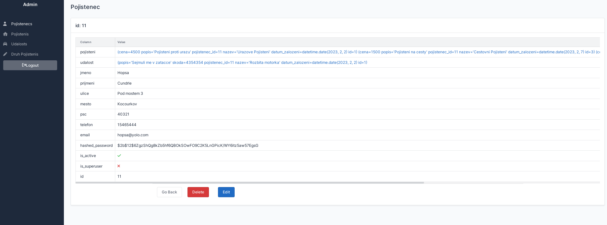{ loading=lazy }
## Admin Pojisteni
{ loading=lazy }
### Pojisteni detail
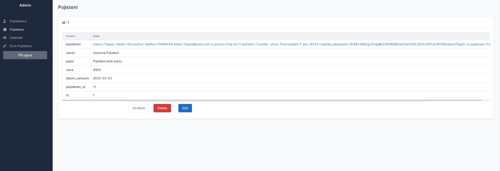{ loading=lazy }
## Admin Udalosti
{ loading=lazy }
### Udalost detail
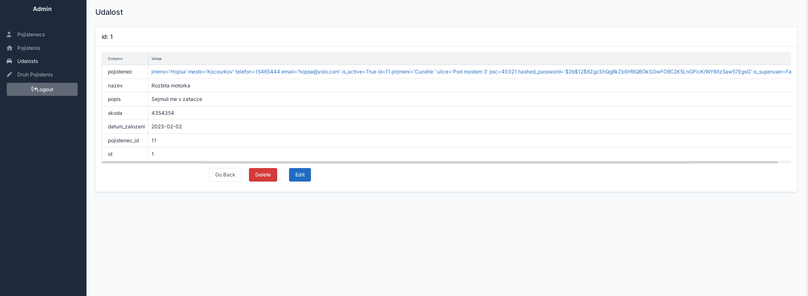{ loading=lazy }
## Admin Druhy pojisteni
{ loading=lazy }

## Vlastni admin zprava
### Admin login
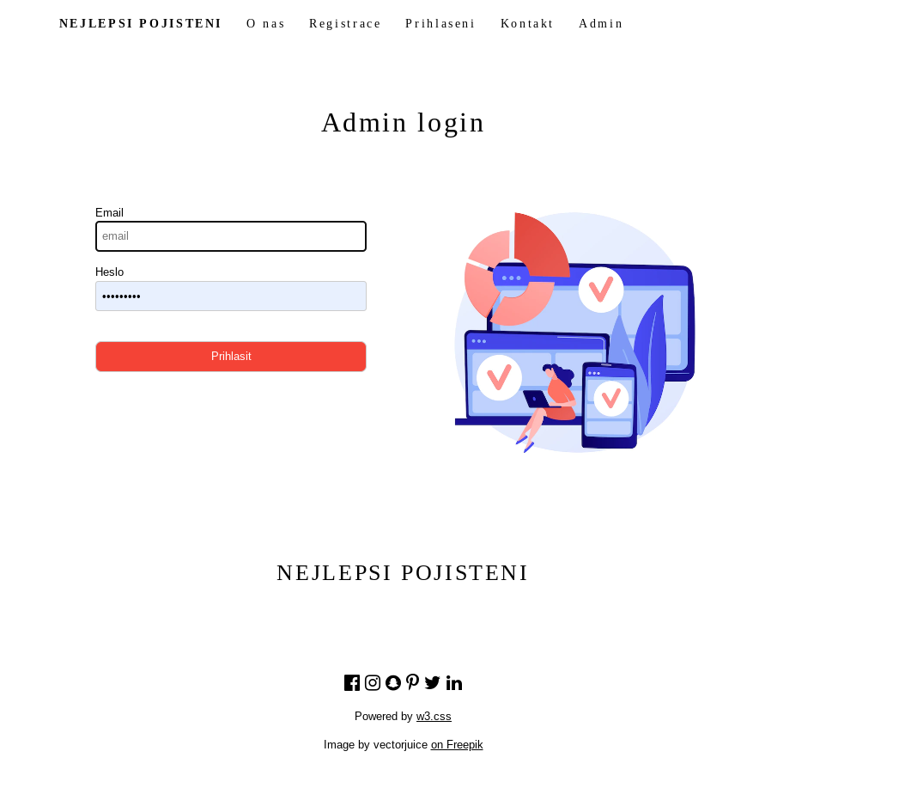{ loading=lazy }
### Admin board
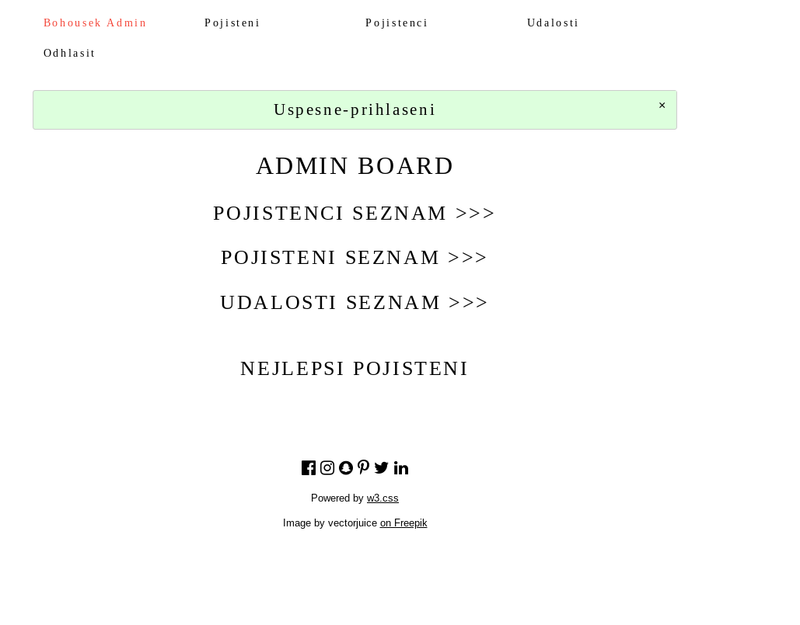{ loading=lazy }
### Pojistenci
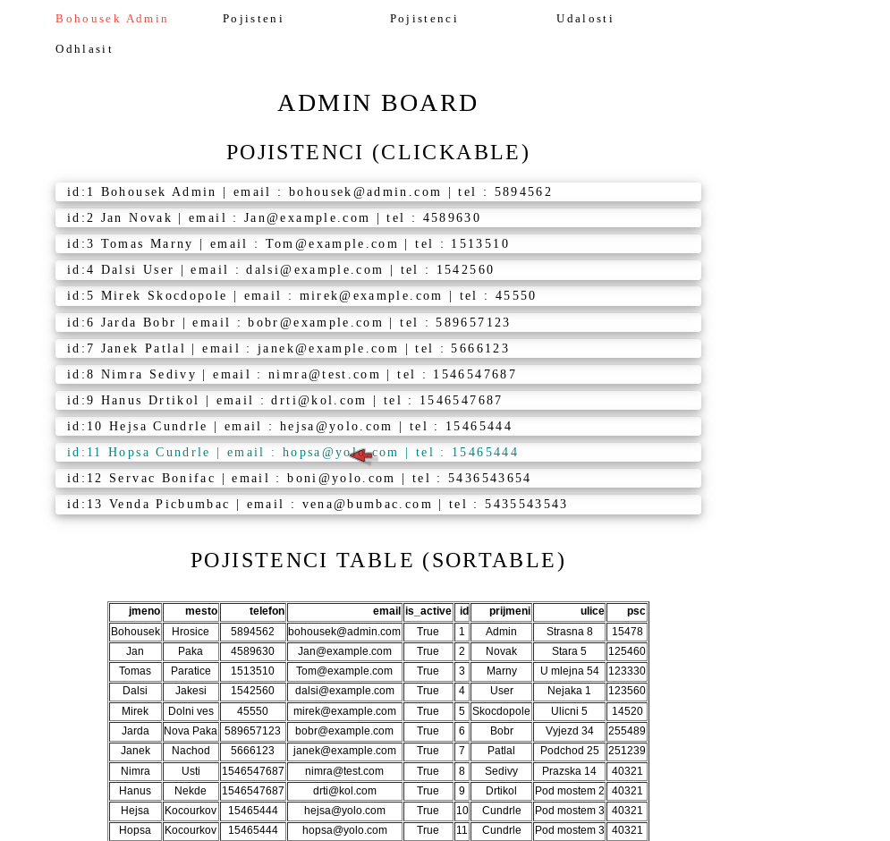{ loading=lazy }
### Pojistenec detail
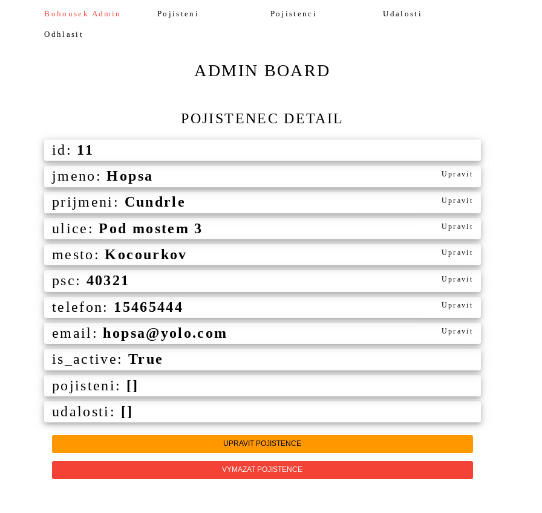{ loading=lazy }
#### Vymazani
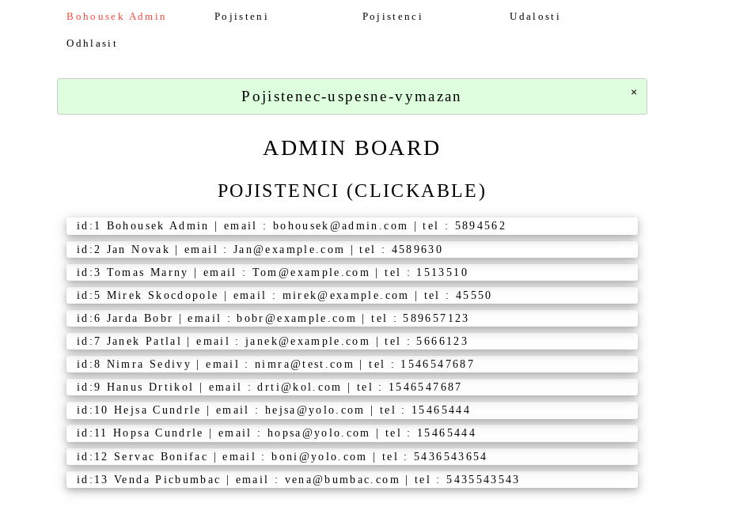{ loading=lazy }
### Pojistenec uprava
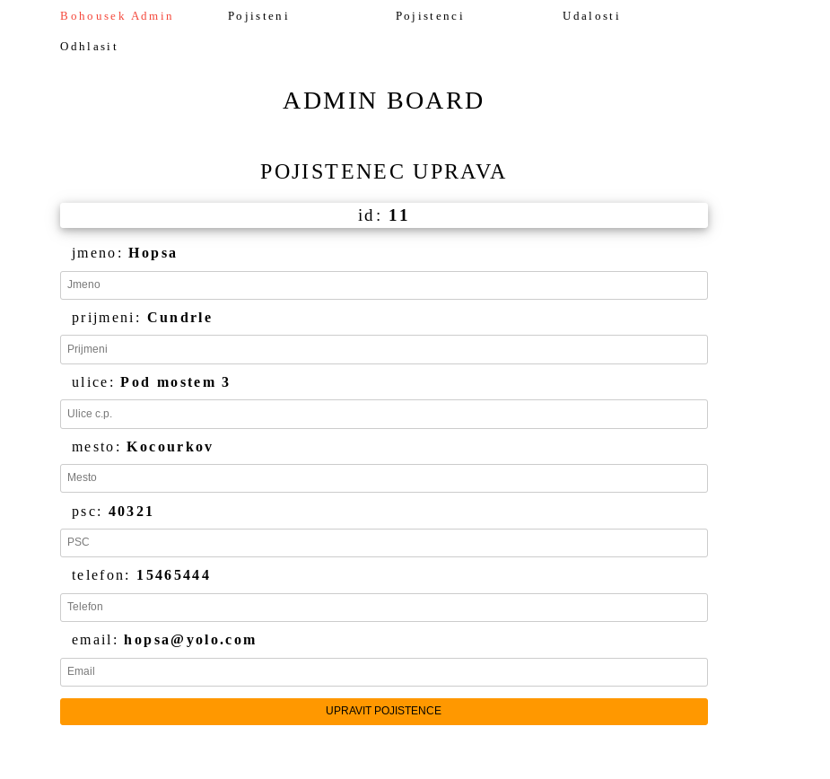{ loading=lazy }
### Pojisteni
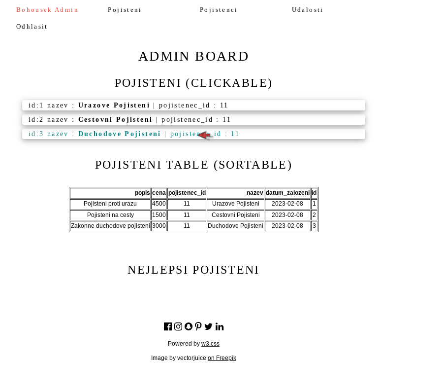{ loading=lazy }
### Pojisteni detail
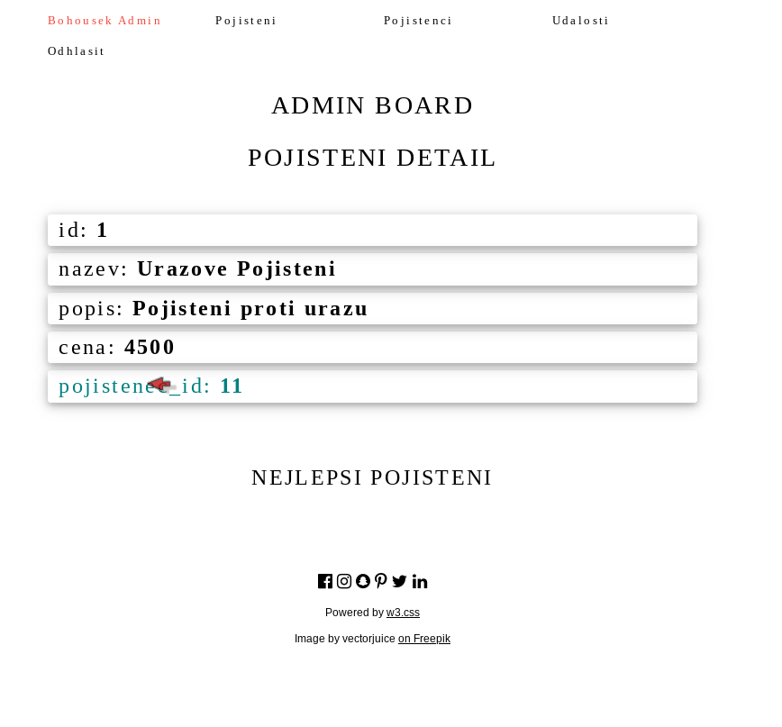{ loading=lazy }
### Udalosti
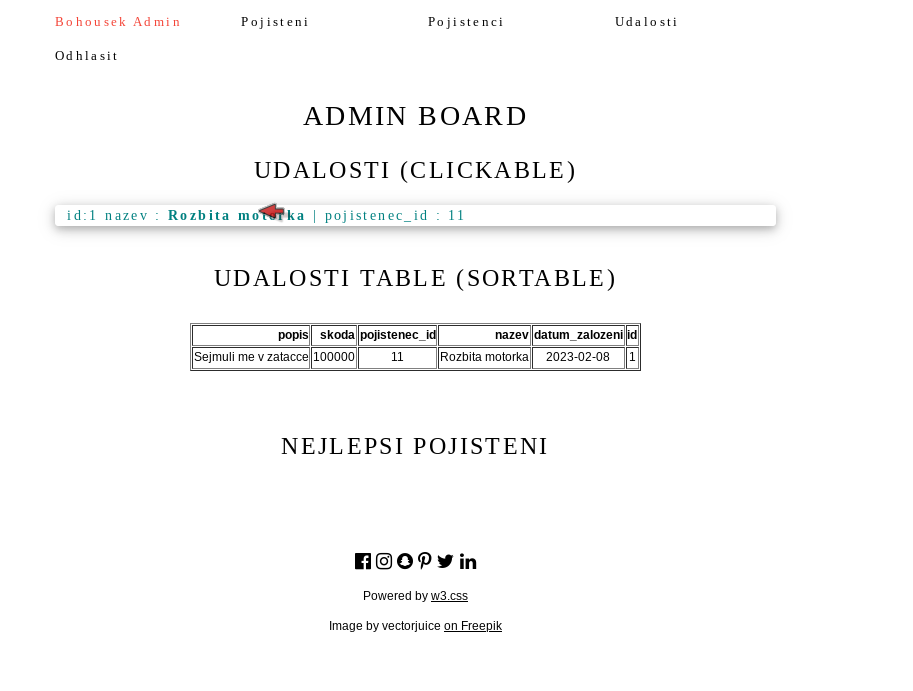{ loading=lazy }
### Udalost detail
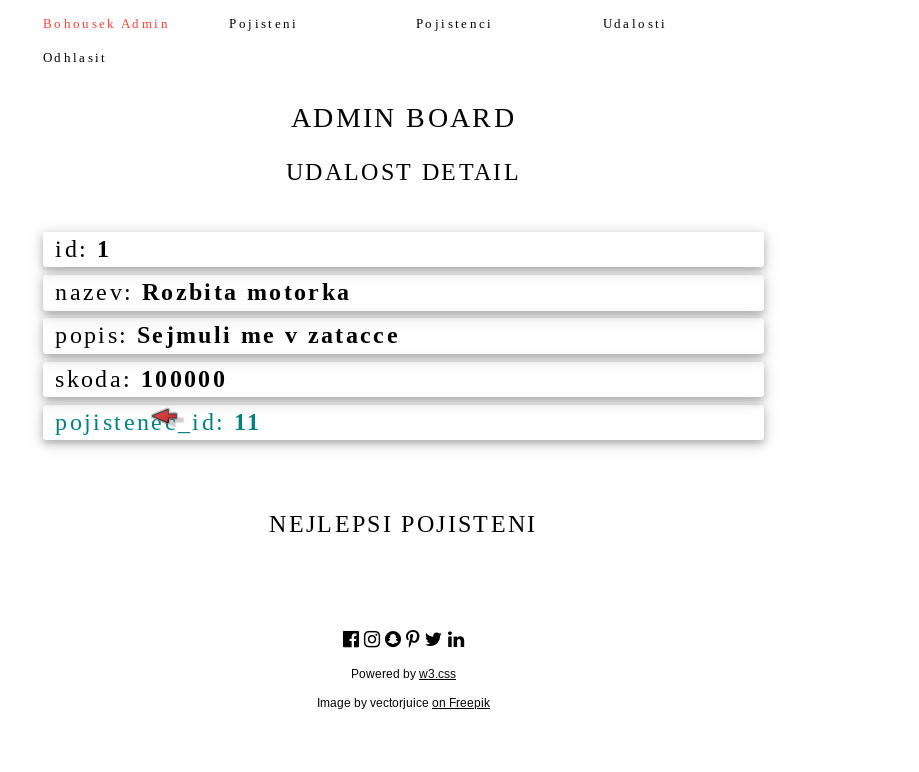{ loading=lazy }
