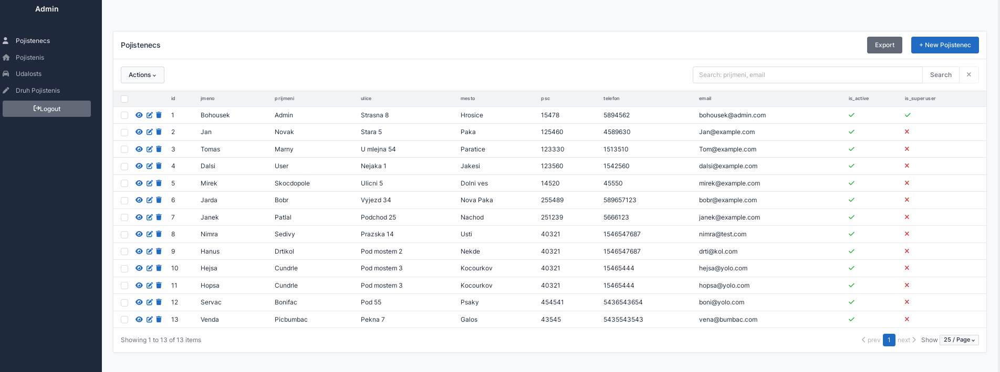
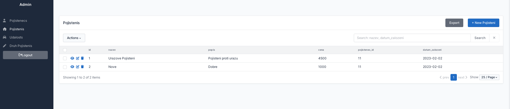
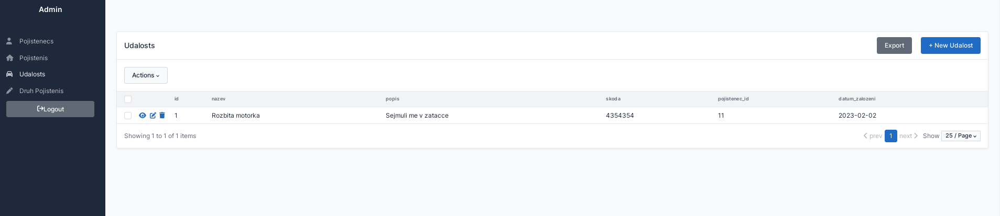
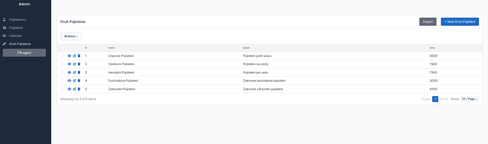

# Admin

## Admin configuration

    Aplikace vyuziva Sqladmin for sqalchemy pro zpravu databaze.
    /admin/

    Ma vsak i vlastni admin rozhrani.
    /administrator/

## SQLadmin

Pro dokumentaci visit [aminalaee.dev/sqladmin](https://aminalaee.dev/sqladmin/)

#### Admin Pojistenec
{ loading=lazy }

#### Admin Pojisteni
{ loading=lazy }

#### Admin Udalosti
{ loading=lazy }

#### Admin Druhy pojisteni
{ loading=lazy }

# Vlastni admin zprava
