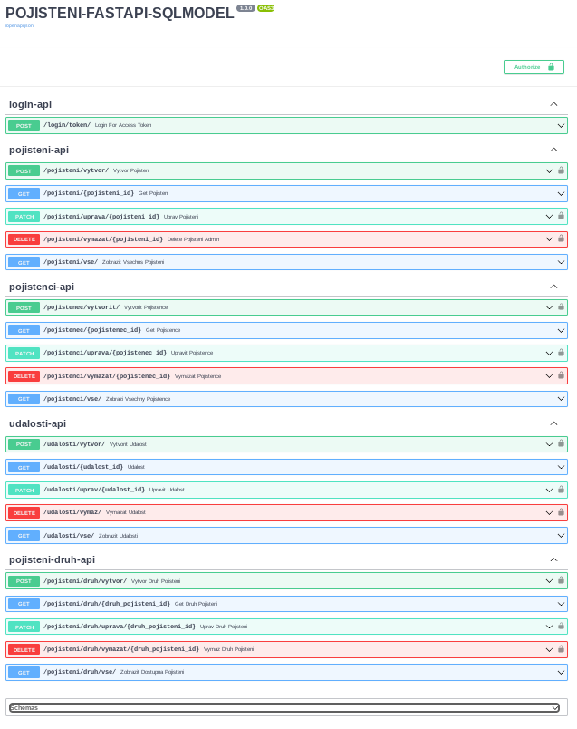
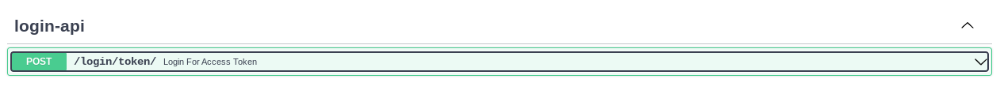
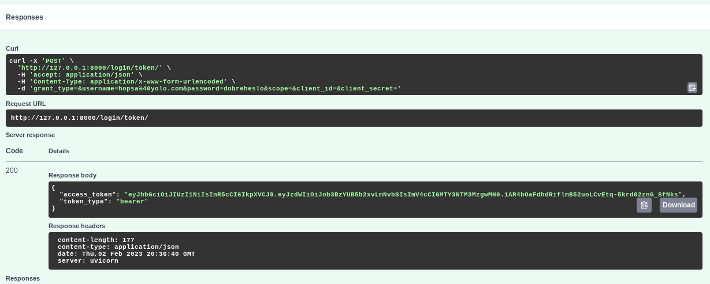
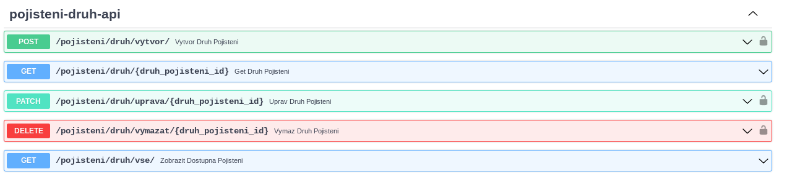
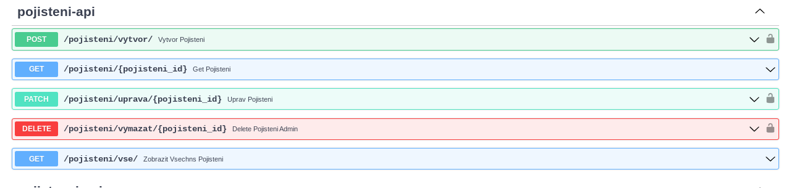
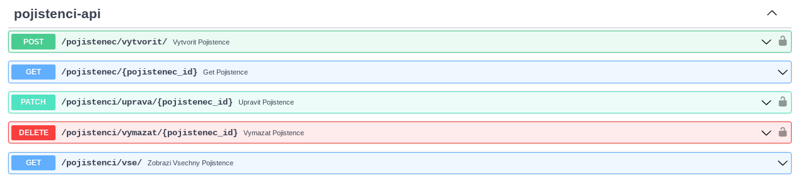
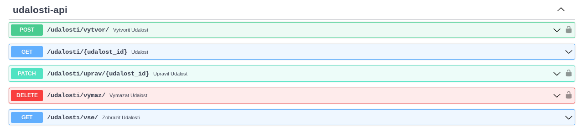

# APIs
FastAPI ma built-in SwaggerUi [swagger.io](https://swagger.io/tools/swagger-ui)

Zde muzeme APIs vyzkouset

## APIs test

### Vlastni install
V pripade vlastni instalace na adrese :

[http://127.0.0.1:8000/docs](http://127.0.0.1:8000/docs)

### Zive demo
Nebo na zivem demu na adrese

[http://143.42.18.67/docs](http://143.42.18.67/docs)

{ loading=lazy }

## Login Api

#### Login path

    /login/token/

{ loading=lazy }

Login API ma POST endpoint ktery po overeni uzivatele vygeneruje token.

Prijme username (v nasem pripade email uzivatele) a heslo, ktere nasledne overi v databazi.

{ loading=lazy }

## Druh pojisteni

Admin muze vytvorit, upravit, vymazat a zobrazit druh pojisteni.

#### Druh pojisteni atributy a datove typy

    Nazev : str
    Popis : str
    Cena  : int

#### Priklad druhu pojisteni

    Havarijni pojisteni
    Pojistuje proti havarii
    1500

#### Api paths druh pojisteni

    /druh_pojisteni/vytvor/
    /druh_pojisteni/pojisteni_id/
    /druh_pojisteni/uprava/
    /druh_pojisteni/vymazat/
    /druh_pojisteni/vse/

{ loading=lazy }

## Pojisteni

Admin muze vytvorit, upravit, vymazat a zobrazit pojisteni.

Musi priradit id pojistence

#### Pojisteni atributy a datove typy

    Nazev : str
    Popis : str
    Cena  : int
    pojistenec_id : int

#### Priklad pojisteni

    Havarijni pojisteni
    Pojistuje proti havarii
    1500
    5

#### Api paths pojisteni

    /pojisteni/vytvor/
    /pojisteni/pojisteni_id/
    /pojisteni/uprava/
    /pojisteni/vymazat/
    /pojisteni/vse/

{ loading=lazy }

## Pojistenec

Admin muze vytvorit, upravit, vymazat a zobrazit pojistence.

#### Pojistenec atributy a datove typy

    jmeno: str
    prijmeni: str
    ulice: str
    mesto: str
    psc: int
    telefon: int
    email: str
    password : str

#### Priklad pojisteni

    jmeno="Jan",
    prijmeni="Novak"
    ulice="Stara 5"
    mesto="Rakovnikov"
    psc=125460
    telefon=4589630
    email="Jan@example.com"
    password="silneheslo"

#### Api paths pojistenec

    * /pojistenec/vytvor/
    * /pojistenec/pojistenec_id/
    * /pojistenec/uprava/
    * /pojistenec/vymazat/
    * /pojistenci/vse/

{ loading=lazy }

## Udalost

Admin muze vytvorit, upravit, vymazat a zobrazit udalost.

Musi priradit id pojistence

#### Udalost atributy a datove typy

    Nazev : str
    Popis : str
    Skoda  : int
    pojistenec_id : int

#### Priklad udalosti

    Rozbita motorka
    Tukli ho u Kauflandu
    35000
    5

#### Api paths udalosti

    /udalost/vytvor/
    /udalost/udalost_id/
    /udalost/uprava/
    /udalost/vymazat/
    /udalosti/vse/

{ loading=lazy }
