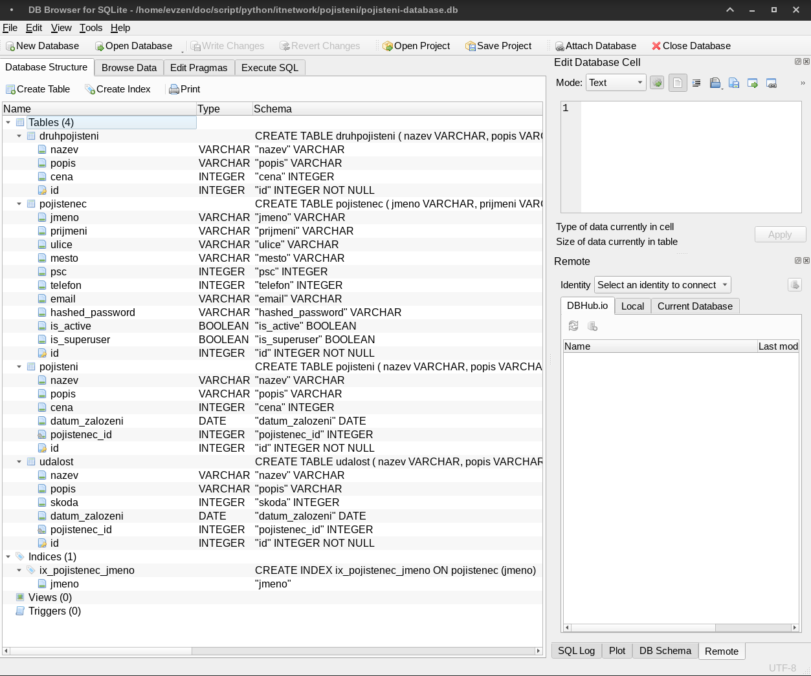

# Databaze

## SQLite

Pro dokumentaci visit [sqlite.org](https://sqlite.org/index.html)

{ loading=lazy }

## SQLModel

SQLModel je knihovna pro komunikaci s SQl databazemi v Python.

SQLModel designed for simplicity, compatibility, and robustness.

Pro dokumentaci visit [sqlmodel.tiangolo.com](https://sqlmodel.tiangolo.com/)

{ loading=lazy }

Vyvojar SQLModel je take vyvojarem FastAPI.

Vyuziva Pydantic pro validaci dat.
