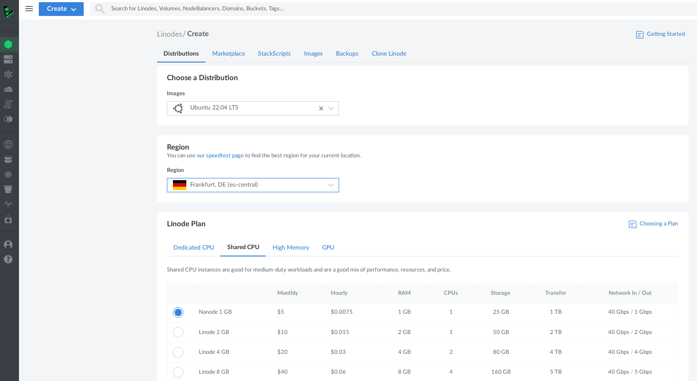
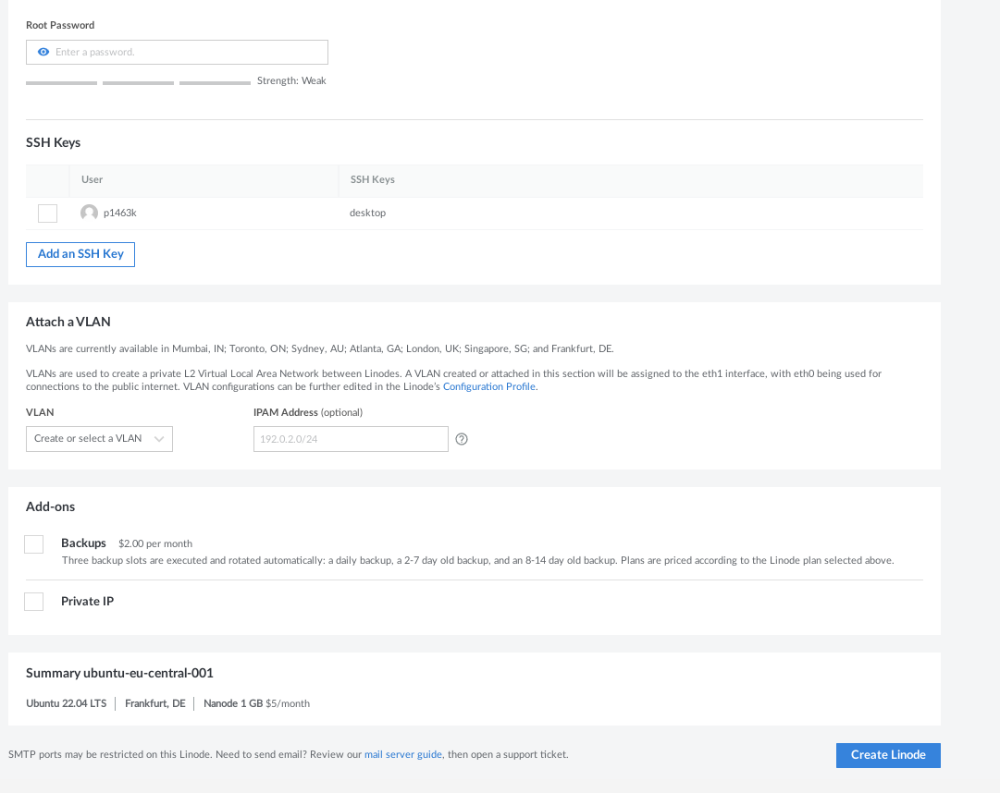

# Linode deploy


## Create Linode

{ loading=lazy }

### Vyplnime root password a ssh key
{ loading=lazy }


### SSH do serveru s linode ip
```
ssh root@123.456.789
```


## Nastaveni
```
$ mkdir /var/www/pojisteni
$ cd /var/www/pojisteni
```

### Vytvorime virtualni prostredi
```
$ virtualenv -p python3.8 venv
$ mkdir src
$ . venv/bin/activate
(venv) $ cd src
```

### Naklonujeme repo
```
git clone https://github.com/3p1463k/pojisteni.git
```

## Konfigurace Nginx

Vytvorime konfiguracni soubor :
```
(venv) $ sudo vim /etc/nginx/sites-available/pojisteni
```
do souboru ulozime nastaveni
```
server{
       server_name <your-site-name>;
       location / {
           include proxy_params;
           proxy_pass http://127.0.0.1:8000;
       }
}
```
Vytvorime symbolickou linku
```
(venv) $ sudo ln -s /etc/nginx/sites-available/myapp /etc/nginx/sites-enabled/
```

### Gunicorn test
```
(venv) $ gunicorn -w 4 -k uvicorn.workers.UvicornWorker main:app
```
## Konfigurace ASGI Serveru

### Deaktivujeme virtualni prostredi
```
(venv) $ deactivate
```
Vytvorime soubor systemd service
```
$ sudo vim /etc/systemd/system/pojisteni.service
```
do souboru vlozime nase atributy
```
[Unit]
Description=Gunicorn instance to serve Pojisteni
After=network.target

[Service]
User=<username>
Group=www-data
WorkingDirectory=/var/www/pojisteni/src
Environment="PATH=/var/www/pojisteni/venv/bin"
ExecStart=/var/www/pojisteni/venv/bin/gunicorn -w 4 -k uvicorn.workers.UvicornWorker main:app

[Install]
WantedBy=multi-user.target
```
Spustime nas service , ktery bude bezet v pozadi
```
$ sudo systemctl start myapp.service
```

## KaBOOM
Otevreme prohizec na adrese [http://143.42.18.67/](http://143.42.18.67/)

{ loading=lazy }
