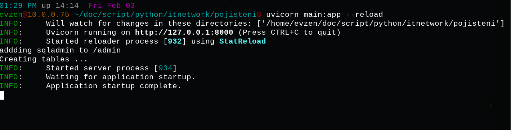

# Instalace

## Instalace

### Vytvoreni virtualniho prostredi

Bash terminal

```
conda create --name pojisteni python=3.10.8
```

Alternativne
```
virtualenv -p <path-to-3.10.8> pojisteni
```

### Clone repo
```
git clone https://github.com/3p1463k/pojisteni.git
```

```
cd pojisteni
```

### Aktivace virtualniho prostredi
```
conda activate pojisteni
```

### Install dependencies

```
pip install -r requirements.txt
```
### Enviroment file

Aby aplikace kompletne fungovala, musime vytvorit .env file a SECRET_KEY

In bash terminal:
```
echo SECRET_KEY=12345678 >> .env
```

### Spusteni Aplikace
```
uvicorn main:app
```
{ loading=lazy }

Aplikace vytvori nekolik uzivatelu a nekolik druhu pojisteni jako testovaci data.

Udaje k vytvorenym pojistencum jsou v adresari:
```
/static/data/
```

Muzete se zaregistrovat, prihlasit, vytvorit pojisteni nebo udalost.

Muzete vyzkouset i admin board. Udaje k admnovi jsou v adresari:
```
/static/script/
```

### Otevreme webovy prohllizec

Na adrese [http://127.0.0.1:8000/](http://127.0.0.1:8000/)

{  width="400" loading=lazy }
