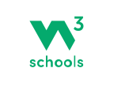

# Templates

## Jinja2
Aplikace vyuziva Jinja2 templates, ma zakladni base.html template a sdilene komponenty.

{ loading=lazy }

Plnohodnotny template engine pro Python.

Vice na [palletsprojects.com](https://palletsprojects.com/p/jinja/)

## W3CSS
{ loading=lazy }

Aplikace je plne responsivni, pouziva W3CSS

A Quality Alternative to Bootstrap

Pro dokumentaci visit [w3schools.com/w3css/](https://www.w3schools.com/w3css/default.asp)
