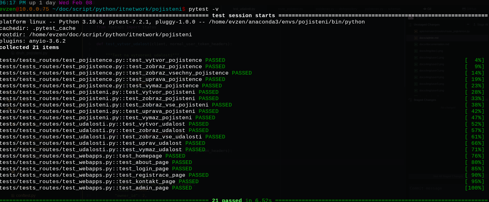

# Testing
Pro dokumentaci visit [docs.pytest.org](https://docs.pytest.org/en/7.2.x/)

## Pytest
{ loading=lazy }

Thanks to Starlette's TestClient, testing FastAPI applications is easy and enjoyable.

```py
from fastapi.testclient import TestClient
```


Vyuziva in-memory db pro lepsi performance.

{ loading=lazy }


Aplikace testuje zakladni operace.

## Druh pojisteni

    Vytvoreni druhu pojisteni
    Uprava druhu pojisteni
    Zobrazeni druhu pojisteni
    Uprava druhu pojisteni
    Vymazani druhu pojisteni

## Pojisteni

    Vytvoreni pojisteni
    Uprava pojisteni
    Zobrazeni pojisteni
    Uprava pojisteni
    Vymazani pojisteni

## Pojistenec

    Vytvoreni pojistence
    Uprava pojistence
    Zobrazeni pojistence
    Uprava pojistence
    Vymazani pojistence

## Udalosti

    Vytvoreni udalosi
    Uprava udalosi
    Zobrazeni udalosi
    Uprava udalosi
    Vymazani udalosi
